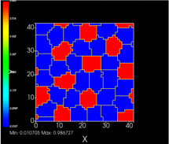

Boundary Conditions for Cells
##############################

Boundary conditions control what happens when a cell or chemical field attempts to cross the edge of the screen (simulation area). 

Related: 
    * `Potts Algorithm: How It Works <potts.html>`_
    * `Boundary Conditions for Diffusion <boundary_conditions_diffusion.html>`_

Periodic
============================

Much like classic arcade games, cells are allowed to "wrap around" and travel to the opposite side when they reach the edge of the screen. 

Specify `Boundary_x` (left & right edges), `Boundary_y` (top & bottom edges), and/or `Boundary_z` (front & back edges) as `Periodic` to enable this behavior. 

.. code-block:: xml

        <Potts>
            <Dimensions x="101" y="101" z="1"/>
            <Boundary_x>Periodic</Boundary_x>
            <Boundary_y>Periodic</Boundary_y>
            <!-- Boundary_z>Periodic</Boundary_z --> <!--Use this for 3D-->
            <Anneal>0</Anneal>
            <Steps>10000</Steps>
            <FluctuationAmplitude>5</FluctuationAmplitude>
            <Flip2DimRatio>1</Flip2DimRatio>
            <NeighborOrder>2</NeighborOrder>
        </Potts>

Periodic boundary conditions are useful for large areas of tissue wherein cells near the edges need to have neighbors. In this example, each red cell has approximately 7 neighbors. This allows us to produce a Delta-Notch Pattern. 

NoFlux
============================

This is the default, and it makes the simulation a finite space. 
Cells cannot cross the boundaries or otherwise interact with opposite edges. 