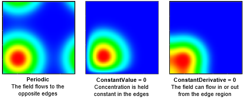
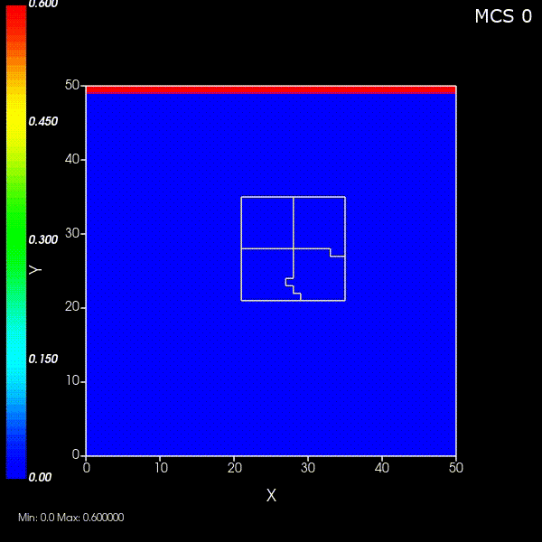
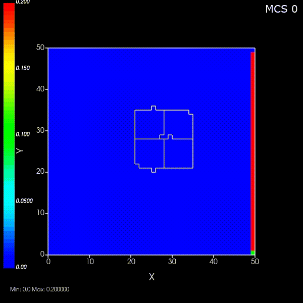
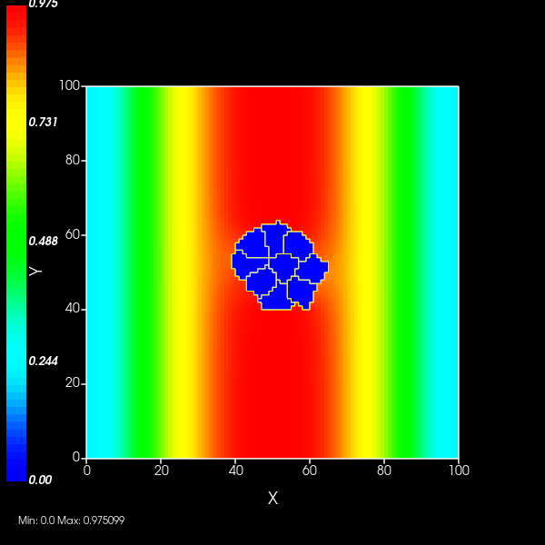

Boundary Conditions for Diffusion
######################################

Boundary conditions not only control what happens when a chemical field attempts to cross the edge of the screen (simulation area); they can also serve as an infinite source from which your chemical may diffuse. 

Related: 
    * `Diffusion Solver Settings <diffusion_solver_settings.html>`_
    * `Boundary Conditions for Cells <boundary_conditions_cells.html>`_

ConstantValue
============================

When Constant Value Diffusion is enabled, the chemical field will emit from the simulation boundary at a constant rate. 
The chemical field then spreads according to a Dirichlet distribution. 
`Max` controls the maximum concentration of the chemical on any given voxel. 
It also controls the maximum concentration that will generate from the source. 

**Example:**

.. code-block:: xml
    
    <Steppable Type="ReactionDiffusionSolverFVM">
        <DeltaT unit="s">1</DeltaT>
        <AutoTimeSubStep/>
        <FluctuationCompensator/>
        <DiffusionField Name="C1">
            <DiffusionData>
                <DiffusionConstant>0.1</DiffusionConstant>
                <DiffusionCoefficient CellType="Type1">0.0</DiffusionCoefficient>
                <DiffusivityByType/>
            </DiffusionData>
            <BoundaryConditions>
                <Plane Axis="Y">
                    <ConstantValue PlanePosition="Min" Value="0.0"/>
                    <ConstantValue PlanePosition="Max" Value="3.0"/>
                </Plane>
            </BoundaryConditions>
        </DiffusionField>
    </Steppable>

**Expected Result:** The chemical C1 reaches a maximum concentration of 3.0.

ConstantDerivative
============================

The primary use of Constant Derivative boundary conditions is to implement zero flux across the simulation boundary. This ensures that the chemical does not flow out of the simulation domain. One could use ``ConstantDerivative`` to simulate inflow/outflow of a chemical to or from the simulation domain. 
Alternatively, it can be used to create curvature or other nonlinear patterns of the substrate. 

To use this feature, you should have one ``Plane`` tag that uses ``ConstantDerivative`` diffusion and another that uses ``ConstantValue``.

**Example:**

.. code-block:: xml

    <Steppable Type="ReactionDiffusionSolverFVM">
        <DeltaT unit="s">1</DeltaT>
        <AutoTimeSubStep/>
        <FluctuationCompensator/>
        <DiffusionField Name="C1">
            <DiffusionData>
                <DiffusionConstant>0.1</DiffusionConstant>
                <DiffusionCoefficient CellType="Type1">0.0</DiffusionCoefficient>
                <DiffusivityByType/>
            </DiffusionData>
            <BoundaryConditions>
                <Plane Axis="X">
                    <ConstantValue PlanePosition="Min" Value="0.0"/>
                    <ConstantValue PlanePosition="Max" Value="1.0"/>
                </Plane>
                <Plane Axis="Y">
                    <ConstantDerivative PlanePosition="Min" Value="1.0"/>
                    <ConstantDerivative PlanePosition="Max" Value="2.0"/>
                </Plane>
            </BoundaryConditions>
        </DiffusionField>
    </Steppable>

**Expected Result:** We attain a semicircle pattern. 

NoFlux
============================

This is the default. It confers no special behaviors to the chemical field. 

Periodic
============================

This allows the chemical field to cross over into the opposite boundary as soon as it reaches the edge of the screen. 

Periodic boundary conditions are useful for large areas of tissue wherein cells near the edges need to have neighbors.
This provides performance benefits since a smaller simulation area can be used. 

**Example:**

.. code-block:: xml

   <Steppable Type="DiffusionSolverFE">
      <FluctuationCompensator/>
      <DiffusionField Name="F1">
         <DiffusionData>
            <FieldName>F1</FieldName>
            <GlobalDiffusionConstant>0.1</GlobalDiffusionConstant>
            <InitialConcentrationExpression>x/100*(1-x/100)*4</InitialConcentrationExpression>
            <DiffusionCoefficient CellType="Type1">0.0</DiffusionCoefficient>
         </DiffusionData>
         <BoundaryConditions>
            <Plane Axis="X">
               <Periodic/>
            </Plane>
            <Plane Axis="Y">
               <Periodic/>
            </Plane>
         </BoundaryConditions>
      </DiffusionField>
   </Steppable>

**Expected Result:** We attain a chemical field that looks symmetrical. 

