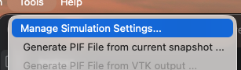
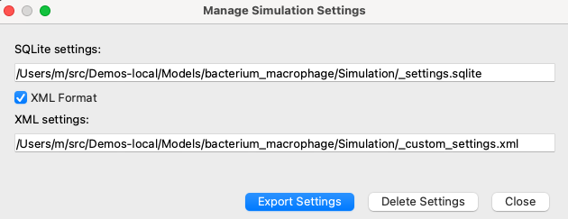

Custom Simulation Visualization Settings
========================================

CompuCell3D can store simulation-specific visualization settings in two
formats:

``_settings.sqlite``
    The standard simulation settings database used by Player.

``_custom_settings.xml``
    A portable XML representation of selected simulation settings. This file is
    convenient for version control, sharing settings with collaborators, and
    applying Player-generated visualization settings to Python-only simulations.

The XML file is optional. When it is present, its settings are loaded on top of
the normal default/global settings. In other words, values in
``_custom_settings.xml`` override the values that would otherwise come from
default or global settings.

Where Settings Files Are Stored
-------------------------------

For a regular ``.cc3d`` project, settings are stored in the project's
``Simulation`` folder::

    MySimulation/
        MySimulation.cc3d
        Simulation/
            _settings.sqlite
            _custom_settings.xml

For Python-only simulations, place ``_custom_settings.xml`` in the same folder
as the Python script that starts the simulation. For example::

    CompuCell3D/core/Demos/CC3DPy/scripts/
        SortingDemo.py
        ChemotaxisDemo.py
        _custom_settings.xml

When a Python-only simulation starts, CC3D checks the folder containing the
top-level Python script. If it finds ``_custom_settings.xml``, it loads those
settings before visualization windows are created.

.. admonition:: Info

   When running Python-only simulations, you may need to update window
   positions in ``_custom_settings.xml``. Window positions generated by Player
   and serialized to XML may not be directly compatible with windows created
   by Python-only visualization. This is especially noticeable when moving
   settings between different display setups, operating systems, or Player and
   CC3DPy visualization.

Generating XML Settings from Player
-----------------------------------

The easiest way to create ``_custom_settings.xml`` is to use Player:

1. Open and start a ``.cc3d`` simulation in Player.
2. Arrange graphics windows, choose fields, adjust scalar ranges, colors, and
   other visualization settings.
3. Open the ``Tools`` menu and choose ``Manage Simulation Settings...``.

4. In the dialog, enable ``XML Format``.
5. Click ``Export Settings``.

Player writes:

- ``Simulation/_settings.sqlite``
- ``Simulation/_custom_settings.xml`` when ``XML Format`` is enabled

To use these settings with a Python-only simulation, copy
``_custom_settings.xml`` into the folder containing the Python script that
starts the simulation.

Basic XML Structure
-------------------

The settings XML file has a root element named ``PlayerSettings`` and a
``Settings`` section. Each individual setting is stored as a ``Setting``
element with a name and type:

.. code-block:: xml

    <?xml version='1.0' encoding='utf-8'?>
    <PlayerSettings Version="1.0" Scope="Simulation">
        <Settings>
            <Setting Name="CellBordersOn" Type="bool">1</Setting>
            <Setting Name="BoundingBoxOn" Type="bool">1</Setting>
            <Setting Name="WindowColor" Type="color">#000000</Setting>
        </Settings>
    </PlayerSettings>

Simple values appear as text inside the setting element. More complex values,
such as dictionaries and lists, are represented using nested ``Item`` elements.

Common scalar types include:

``bool``
    Stored as ``1`` for true and ``0`` for false.

``int`` and ``float``
    Numeric values.

``str``
    Text values.

``color``
    Hex RGB colors such as ``#ff0000``.

``point`` and ``size``
    Two integer values separated by a comma. These are commonly used for
    window position and window size.

Cell Type Colors
----------------

The ``TypeColorMap`` setting controls colors assigned to cell type ids. It is a
dictionary where keys are integer cell type ids and values are colors:

.. code-block:: xml

    <Setting Name="TypeColorMap" Type="dict">
        <Item Key="0" KeyType="int" Type="color">#000000</Item>
        <Item Key="1" KeyType="int" Type="color">#0000ff</Item>
        <Item Key="2" KeyType="int" Type="color">#008000</Item>
        <Item Key="3" KeyType="int" Type="color">#ff0000</Item>
    </Setting>

Cell type id ``0`` is normally Medium. Other ids correspond to the cell types
declared in the simulation.

FieldParams
-----------

``FieldParams`` stores visualization settings for scalar and vector fields.
Each entry is keyed by field name. For example, the following configures a
field named ``ATTR``:

.. code-block:: xml

    <Setting Name="FieldParams" Type="dict">
        <Item Key="ATTR" KeyType="str" Type="dict">
            <Item Key="ShowPlotAxes" KeyType="str" Type="bool">1</Item>
            <Item Key="MinRange" KeyType="str" Type="float">0.0</Item>
            <Item Key="MinRangeFixed" KeyType="str" Type="bool">1</Item>
            <Item Key="MaxRange" KeyType="str" Type="float">1.0</Item>
            <Item Key="MaxRangeFixed" KeyType="str" Type="bool">0</Item>
            <Item Key="NumberOfLegendBoxes" KeyType="str" Type="int">6</Item>
            <Item Key="NumberAccuracy" KeyType="str" Type="int">2</Item>
            <Item Key="LegendEnable" KeyType="str" Type="bool">1</Item>
            <Item Key="OverlayVectorsOn" KeyType="str" Type="bool">0</Item>
            <Item Key="ContoursOn" KeyType="str" Type="bool">0</Item>
            <Item Key="ScalarIsoValues" KeyType="str" Type="str" />
            <Item Key="NumberOfContourLines" KeyType="str" Type="int">9</Item>
            <Item Key="ArrowLength" KeyType="str" Type="int">1</Item>
            <Item Key="ScaleArrowsOn" KeyType="str" Type="bool">0</Item>
            <Item Key="FixedArrowColorOn" KeyType="str" Type="bool">0</Item>
            <Item Key="ArrowColor" KeyType="str" Type="color">#ffffff</Item>
        </Item>
    </Setting>

Important entries include:

``MinRange`` and ``MaxRange``
    The scalar range used for color mapping.

``MinRangeFixed`` and ``MaxRangeFixed``
    Whether the range endpoints are fixed by the user instead of being
    computed automatically from field values.

``LegendEnable``
    Controls whether the color legend is displayed.

``NumberOfLegendBoxes`` and ``NumberAccuracy``
    Control legend appearance.

``ContoursOn`` and ``NumberOfContourLines``
    Control contour display for scalar fields.

``OverlayVectorsOn``, ``ArrowLength``, ``ScaleArrowsOn``,
``FixedArrowColorOn``, and ``ArrowColor``
    Control vector overlay rendering when vector data are displayed.

If a field does not have an entry in ``FieldParams``, CC3D uses default field
visualization settings for that field.

WindowsLayout
-------------

``WindowsLayout`` stores graphics-window layout information. It is a dictionary
of windows. Each window entry contains the scene name, window size and
position, and VTK camera settings:

.. code-block:: xml

    <Setting Name="WindowsLayout" Type="dict">
        <Item Key="0" KeyType="int" Type="dict">
            <Item Key="sceneName" KeyType="str" Type="str">Cell_Field</Item>
            <Item Key="winPosition" KeyType="str" Type="point">853,-744</Item>
            <Item Key="winSize" KeyType="str" Type="size">420,280</Item>
            <Item Key="cameraClippingRange" KeyType="str" Type="tuple">
                <Item Type="float">374.6708309603021</Item>
                <Item Type="float">432.84803158060953</Item>
            </Item>
            <Item Key="cameraFocalPoint" KeyType="str" Type="tuple">
                <Item Type="float">50.0</Item>
                <Item Type="float">50.0</Item>
                <Item Type="float">0.0</Item>
            </Item>
            <Item Key="cameraPosition" KeyType="str" Type="tuple">
                <Item Type="float">50.0</Item>
                <Item Type="float">50.0</Item>
                <Item Type="float">399.9995587361593</Item>
            </Item>
            <Item Key="cameraViewUp" KeyType="str" Type="tuple">
                <Item Type="float">0.0</Item>
                <Item Type="float">1.0</Item>
                <Item Type="float">0.0</Item>
            </Item>
        </Item>
    </Setting>

The most important key is ``sceneName``. CC3D uses it to match a saved layout
entry to a visualization. For example, if a Python-only simulation creates
windows for ``Cell_Field``, ``F1``, and ``F2``, but ``WindowsLayout`` only
contains entries for ``Cell_Field`` and ``F2``, then only those two windows get
their saved layout. The ``F1`` window uses the normal default visualization
settings.

In Python-only simulations, CC3D currently restores the window position, window
size, and VTK camera settings from ``WindowsLayout``. Projection-related
entries such as ``planeName``, ``planePosition``, and ``is3D`` may appear in the
XML file, but Python-only visualization may ignore them.

Editing XML by Hand
-------------------

You can edit ``_custom_settings.xml`` in a text editor. This is useful for
small changes such as adjusting colors or scalar ranges. Keep the following in
mind:

- Preserve the ``Name``, ``Type``, ``Key``, and ``KeyType`` attributes.
- Boolean values are ``1`` and ``0``.
- Colors use ``#rrggbb`` format.
- Dictionary entries use nested ``Item`` elements.
- XML overrides default/global settings only for settings present in the file.

For larger changes, it is usually easier to arrange windows and visualization
settings in Player and export a new XML file using ``Manage Simulation
Settings...``.

_custom_settings.xml example
----------------------------

.. code-block:: xml

    <?xml version='1.0' encoding='utf-8'?>
    <PlayerSettings Version="1.0" Scope="Simulation">
        <Settings>
            <Setting Name="ArrowColor" Type="color">#ffffff</Setting>
            <Setting Name="ArrowLength" Type="int">1</Setting>
            <Setting Name="AutomaticMovie" Type="bool">0</Setting>
            <Setting Name="Axes3DColor" Type="color">#ffffff</Setting>
            <Setting Name="AxesColor" Type="color">#ffffff</Setting>
            <Setting Name="BorderColor" Type="color">#ffff00</Setting>
            <Setting Name="BoundingBoxColor" Type="color">#ffffff</Setting>
            <Setting Name="BoundingBoxOn" Type="bool">1</Setting>
            <Setting Name="BrushColor" Type="color">#ffffff</Setting>
            <Setting Name="CC3DOutputOn" Type="bool">1</Setting>
            <Setting Name="CellBordersOn" Type="bool">1</Setting>
            <Setting Name="CellGlyphPhiRes" Type="int">2</Setting>
            <Setting Name="CellGlyphScale" Type="float">1.0</Setting>
            <Setting Name="CellGlyphScaleByVolumeOn" Type="bool">0</Setting>
            <Setting Name="CellGlyphThetaRes" Type="int">2</Setting>
            <Setting Name="CellGlyphsOn" Type="bool">0</Setting>
            <Setting Name="CellShellOptimization" Type="bool">0</Setting>
            <Setting Name="CellsOn" Type="bool">1</Setting>
            <Setting Name="ClusterBorderColor" Type="color">#0000ff</Setting>
            <Setting Name="ClusterBordersOn" Type="bool">0</Setting>
            <Setting Name="ConcentrationLimitsOn" Type="bool">1</Setting>
            <Setting Name="ContourColor" Type="color">#ffffff</Setting>
            <Setting Name="ContoursOn" Type="bool">0</Setting>
            <Setting Name="DisplayCellTypeColorMap" Type="bool">1</Setting>
            <Setting Name="DisplayUnits" Type="bool">1</Setting>
            <Setting Name="FPPLinksColor" Type="color">#ffffff</Setting>
            <Setting Name="FPPLinksColorOn" Type="bool">0</Setting>
            <Setting Name="FPPLinksOn" Type="bool">0</Setting>
            <Setting Name="FieldParams" Type="dict">
                <Item Key="ATTR" KeyType="str" Type="dict">
                    <Item Key="ShowPlotAxes" KeyType="str" Type="bool">1</Item>
                    <Item Key="MinRange" KeyType="str" Type="float">0.0</Item>
                    <Item Key="MinRangeFixed" KeyType="str" Type="bool">1</Item>
                    <Item Key="MaxRange" KeyType="str" Type="float">1.0</Item>
                    <Item Key="MaxRangeFixed" KeyType="str" Type="bool">0</Item>
                    <Item Key="NumberOfLegendBoxes" KeyType="str" Type="int">6</Item>
                    <Item Key="NumberAccuracy" KeyType="str" Type="int">2</Item>
                    <Item Key="LegendEnable" KeyType="str" Type="bool">1</Item>
                    <Item Key="OverlayVectorsOn" KeyType="str" Type="bool">0</Item>
                    <Item Key="ContoursOn" KeyType="str" Type="bool">0</Item>
                    <Item Key="ScalarIsoValues" KeyType="str" Type="str" />
                    <Item Key="NumberOfContourLines" KeyType="str" Type="int">9</Item>
                    <Item Key="ArrowLength" KeyType="str" Type="int">1</Item>
                    <Item Key="ScaleArrowsOn" KeyType="str" Type="bool">0</Item>
                    <Item Key="FixedArrowColorOn" KeyType="str" Type="bool">0</Item>
                    <Item Key="ArrowColor" KeyType="str" Type="color">#ffffff</Item>
                </Item>
            </Setting>
            <Setting Name="FixedArrowColorOn" Type="bool">0</Setting>
            <Setting Name="FrameRate" Type="int">7</Setting>
            <Setting Name="ImageOutputOn" Type="bool">1</Setting>
            <Setting Name="LatticeOutputOn" Type="bool">0</Setting>
            <Setting Name="LegendEnable" Type="bool">1</Setting>
            <Setting Name="MaxRange" Type="float">1.0</Setting>
            <Setting Name="MaxRangeFixed" Type="bool">0</Setting>
            <Setting Name="MinRange" Type="float">0.0</Setting>
            <Setting Name="MinRangeFixed" Type="bool">1</Setting>
            <Setting Name="NumberAccuracy" Type="int">2</Setting>
            <Setting Name="NumberOfContourLines" Type="int">9</Setting>
            <Setting Name="NumberOfLegendBoxes" Type="int">6</Setting>
            <Setting Name="NumberOfStepOutputs" Type="int">10</Setting>
            <Setting Name="OutputToProjectOn" Type="bool">0</Setting>
            <Setting Name="OverlayVectorsOn" Type="bool">0</Setting>
            <Setting Name="PauseAt" Type="str" />
            <Setting Name="PenColor" Type="color">#000000</Setting>
            <Setting Name="PixelizedCartesianFields" Type="bool">1</Setting>
            <Setting Name="Projection" Type="int">0</Setting>
            <Setting Name="Quality" Type="int">5</Setting>
            <Setting Name="RecentMoviePath" Type="str">
                /Users/m/CC3DWorkspace/bacterium_macrophage_2D_steering_cc3d_04_15_2026_10_42_07_dfa401
            </Setting>
            <Setting Name="RestartAllowMultipleSnapshots" Type="bool">1</Setting>
            <Setting Name="RestartOutputEnable" Type="bool">1</Setting>
            <Setting Name="RestartOutputFrequency" Type="int">100</Setting>
            <Setting Name="SaveImageFrequency" Type="int">100</Setting>
            <Setting Name="SaveLatticeFrequency" Type="int">100</Setting>
            <Setting Name="ScalarIsoValues" Type="str" />
            <Setting Name="ScaleArrowsOn" Type="bool">0</Setting>
            <Setting Name="ScreenUpdateFrequency" Type="int">10</Setting>
            <Setting Name="Screenshot_X" Type="int">600</Setting>
            <Setting Name="Screenshot_Y" Type="int">600</Setting>
            <Setting Name="Show3DAxes" Type="bool">1</Setting>
            <Setting Name="ShowAxes" Type="bool">1</Setting>
            <Setting Name="ShowHorizontalAxesLabels" Type="bool">1</Setting>
            <Setting Name="ShowPlotAxes" Type="bool">1</Setting>
            <Setting Name="ShowVerticalAxesLabels" Type="bool">1</Setting>
            <Setting Name="TypeColorMap" Type="dict">
                <Item Key="0" KeyType="int" Type="color">#000000</Item>
                <Item Key="1" KeyType="int" Type="color">salmon</Item>
                <Item Key="2" KeyType="int" Type="color">yellow</Item>
                <Item Key="3" KeyType="int" Type="color">olive</Item>
                <Item Key="4" KeyType="int" Type="color">#ffff00</Item>
                <Item Key="5" KeyType="int" Type="color">#a52a2a</Item>
                <Item Key="6" KeyType="int" Type="color">#add8e6</Item>
                <Item Key="7" KeyType="int" Type="color">#90ee90</Item>
                <Item Key="8" KeyType="int" Type="color">#800080</Item>
                <Item Key="9" KeyType="int" Type="color">#ffa500</Item>
                <Item Key="10" KeyType="int" Type="color">#40e0d0</Item>
            </Setting>
            <Setting Name="Types3DInvisible" Type="str">0</Setting>
            <Setting Name="WindowColor" Type="color">#000000</Setting>
            <Setting Name="WindowColorSameAsMedium" Type="bool">0</Setting>
            <Setting Name="WindowsLayout" Type="dict">
                <Item Key="0" KeyType="int" Type="dict">
                    <Item Key="sceneName" KeyType="str" Type="str">Cell_Field</Item>
                    <Item Key="sceneType" KeyType="str" Type="none" />
                    <Item Key="planeName" KeyType="str" Type="str">xy</Item>
                    <Item Key="planePosition" KeyType="str" Type="int">0</Item>
                    <Item Key="is3D" KeyType="str" Type="bool">0</Item>
                    <Item Key="winPosition" KeyType="str" Type="point">50,50</Item>
                    <Item Key="winSize" KeyType="str" Type="size">420,280</Item>
                    <Item Key="winType" KeyType="str" Type="str">Graphics</Item>
                    <Item Key="cameraClippingRange" KeyType="str" Type="tuple">
                        <Item Type="float">255.90521887869795</Item>
                        <Item Type="float">295.64102969784125</Item>
                    </Item>
                    <Item Key="cameraFocalPoint" KeyType="str" Type="tuple">
                        <Item Type="float">50.0</Item>
                        <Item Type="float">50.0</Item>
                        <Item Type="float">0.0</Item>
                    </Item>
                    <Item Key="cameraPosition" KeyType="str" Type="tuple">
                        <Item Type="float">50.0</Item>
                        <Item Type="float">50.0</Item>
                        <Item Type="float">273.2050807568875</Item>
                    </Item>
                    <Item Key="cameraViewUp" KeyType="str" Type="tuple">
                        <Item Type="float">0.0</Item>
                        <Item Type="float">1.0</Item>
                        <Item Type="float">0.0</Item>
                    </Item>
                </Item>
                <Item Key="1" KeyType="int" Type="dict">
                    <Item Key="sceneName" KeyType="str" Type="str">F2</Item>
                    <Item Key="sceneType" KeyType="str" Type="none" />
                    <Item Key="planeName" KeyType="str" Type="str">xy</Item>
                    <Item Key="planePosition" KeyType="str" Type="int">0</Item>
                    <Item Key="is3D" KeyType="str" Type="bool">0</Item>
                    <Item Key="winPosition" KeyType="str" Type="point">500,500</Item>
                    <Item Key="winSize" KeyType="str" Type="size">772,566</Item>
                    <Item Key="winType" KeyType="str" Type="str">Graphics</Item>
                    <Item Key="cameraClippingRange" KeyType="str" Type="tuple">
                        <Item Type="float">255.90521887869818</Item>
                        <Item Type="float">295.6410296978415</Item>
                    </Item>
                    <Item Key="cameraFocalPoint" KeyType="str" Type="tuple">
                        <Item Type="float">50.0</Item>
                        <Item Type="float">50.0</Item>
                        <Item Type="float">0.0</Item>
                    </Item>
                    <Item Key="cameraPosition" KeyType="str" Type="tuple">
                        <Item Type="float">50.0</Item>
                        <Item Type="float">50.0</Item>
                        <Item Type="float">273.20508075688775</Item>
                    </Item>
                    <Item Key="cameraViewUp" KeyType="str" Type="tuple">
                        <Item Type="float">0.0</Item>
                        <Item Type="float">1.0</Item>
                        <Item Type="float">0.0</Item>
                    </Item>
                </Item>
    <!--            <Item Key="2" KeyType="int" Type="dict">-->
    <!--                <Item Key="sceneName" KeyType="str" Type="str">F1</Item>-->
    <!--                <Item Key="sceneType" KeyType="str" Type="none" />-->
    <!--                <Item Key="planeName" KeyType="str" Type="str">xy</Item>-->
    <!--                <Item Key="planePosition" KeyType="str" Type="int">0</Item>-->
    <!--                <Item Key="is3D" KeyType="str" Type="bool">0</Item>-->
    <!--                <Item Key="winPosition" KeyType="str" Type="point">1000,1000</Item>-->
    <!--                <Item Key="winSize" KeyType="str" Type="size">772,566</Item>-->
    <!--                <Item Key="winType" KeyType="str" Type="str">Graphics</Item>-->
    <!--                <Item Key="cameraClippingRange" KeyType="str" Type="tuple">-->
    <!--                    <Item Type="float">255.90521887869818</Item>-->
    <!--                    <Item Type="float">295.6410296978415</Item>-->
    <!--                </Item>-->
    <!--                <Item Key="cameraFocalPoint" KeyType="str" Type="tuple">-->
    <!--                    <Item Type="float">50.0</Item>-->
    <!--                    <Item Type="float">50.0</Item>-->
    <!--                    <Item Type="float">0.0</Item>-->
    <!--                </Item>-->
    <!--                <Item Key="cameraPosition" KeyType="str" Type="tuple">-->
    <!--                    <Item Type="float">50.0</Item>-->
    <!--                    <Item Type="float">50.0</Item>-->
    <!--                    <Item Type="float">273.20508075688775</Item>-->
    <!--                </Item>-->
    <!--                <Item Key="cameraViewUp" KeyType="str" Type="tuple">-->
    <!--                    <Item Type="float">0.0</Item>-->
    <!--                    <Item Type="float">1.0</Item>-->
    <!--                    <Item Type="float">0.0</Item>-->
    <!--                </Item>-->
    <!--            </Item>-->
            </Setting>
            <Setting Name="WriteMovieMCS" Type="bool">1</Setting>
            <Setting Name="ZoomFactor" Type="float">1.0</Setting>
        </Settings>
    </PlayerSettings>