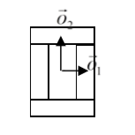
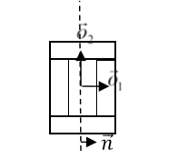
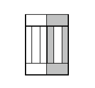
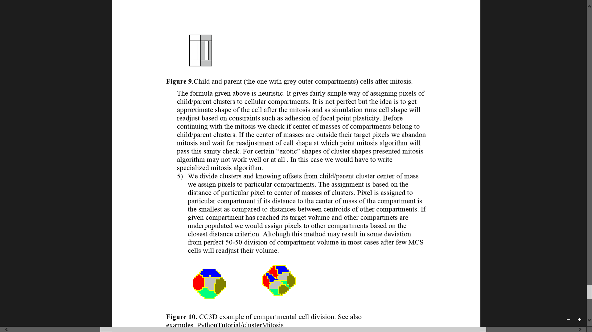

Dividing cluster cells
----------------------

While dividing non-clustered cells is straightforward, doing the same
for clustered cells is more challenging. To divide non-cluster cell
using directional mitosis algorithm we construct a line or a plane
passing through center of mass of a cell and pixels of the cell (we are
using PixelTracker plugin with mitosis) on one side of the line/plane
end up in child cell and the rest stays in parent cell. The orientation
of the line/plane can be either specified by the user or we can use CC3D
built-in feature to calculate calculate orientation tion of principal
axes and divide either along minor or major axis.

With compartmental cells, things get more complicated because: 1)
Compartmental cells are composed of many subcells. 2) There can be
different topologies of clusters. Some clusters may look "snake-like"
and some might be compactly packed blobs of subcells. The algorithm
which we implemented in CC3D works in the following way:

1) We first construct a set of pixels containing every pixel belonging
   to a cluster cell. You may think of it as of a single “regular” cell.

2) We store volumes of compartments so that we know how big compartments
   should be after mitosis (they will be half of original volume)

3) We calculate center of mass of entire cluster and calculate vector
   offsets between center of mass of a cluster and center of mass of
   particular compartments as on the figure below:

|compartments_fig_7|

**Figure 7**.Vectors :math:`\vec{o}_1` and :math:`\vec{o}_2` show offsets between center of mass of a
cluster and center of mass particular compartments.

4) We pick division line/plane and for parents and child cells we
  offsets between cluster center of mass (after mitosis) and center
  of masses of clusters. We do it according to the formula:

.. math::
   :nowrap:

   \begin{eqnarray}
      \vec{p} = \vec{o} - \frac{1}{2}(\vec{o} \ddot \vec{n})\vec{n}
   \end{eqnarray}

   where :math:`\vec{p}` denotes offset after mitosis from center of mass of child
   (parent) clusters, :math:`\vec{o}` is orientation vector before mitosis (see
   picture above) and :math:`\vec{n}` is a normalized vector perpendicular to division
   line/plane. If we try to divide the cluster along dashed line as on
   the picture below:

|compartments_fig_8|

**Figure 8**. Division of cell along dashed line. Notice the
  orientation of :math:`\vec{n}` . The offsets after the mitosis for child and parent cell will be
   :math:`\vec{p}_1=\frac{1}{2}\vec{o}_1` and :math:`\vec{p}_2=\vec{o}_2` as
  expected because both parent and child cells will retain their heights
  but after mitosis will become twice narrower (cell with grey outer
  compartments is a parent cell):

|compartments_fig_9|

**Figure 9**.Child and parent (the one with grey outer compartments)
cells after mitosis.

 The formula given above is heuristic. It gives fairly simple way of
 assigning pixels of child/parent clusters to cellular compartments.
 It is not perfect but the idea is to get approximate shape of the
 cell after the mitosis and as simulation runs cell shape will
 readjust based on constraints such as adhesion of focal point
 plasticity. Before continuing with the mitosis we check if center of
 masses of compartments belong to child/parent clusters. If the
 center of masses are outside their target pixels we abandon mitosis
 and wait for readjustment of cell shape at which point mitosis
 algorithm will pass this sanity check. For certain “exotic” shapes
 of cluster shapes presented mitosis algorithm may not work well or
 at all. In this case we would have to write specialized mitosis
 algorithm.

5) We divide clusters and knowing offsets from child/parent cluster
   center of mass we assign pixels to particular compartments. The
   assignment is based on the distance of particular pixel to center of
   masses of clusters. Pixel is assigned to particular compartment if
   its distance to the center of mass of the compartment is the smallest
   as compared to distances between centroids of other compartments. If
   given compartment has reached its target volume and other compartments
   are underpopulated we would assign pixels to other compartments based
   on the closest distance criterion. Although this method may result in
   some deviation from perfect 50-50 division of compartment volume in
   most cases after few MCS cells will readjust their volume.

   |compartments_fig_10|

**Figure 10.** CC3D example of compartmental cell division. See also
Demos/CompuCellPythonTutorial/clusterMitosis.

