Compartments, FPP Links and Curvature - how to build elongated cells.
------------------------------------------------------------------------------------------------------------

The goal of this tutorial is to teach you how to transform the most basic simulation involving just a single cell into
a simulation involving multiple elongated cells where each cell is composed of compartments.
We want the cells to stay elongated throughout the course of the simulation.

Understanding Contact Energies - how to avoid pixelated cells
~~~~~~~~~~~~~~~~~~~~~~~~~~~~~~~~~~~~~~~~~~~~~~~~~~~~~~~~~~~~~~

Now that we know about compartments and how they are handled by CC3D, let's see how we can  translate our knowledge
into building a simple simulation that involves contact energies. In particular, we want to show you a common pitfall
that you may encounter in your work and how to diagnose it.

In fact this tutorial is an intro to a more sophisticated simulation where we will leverage Focal Point Plasticity Plugin
and Curvature plugin.

.. note::

    Our intention is to teach you how you can start building complex simulation from grounds up
    by starting with a single cell understand the behavior of the single cell under different set of parameters
    and gradually adding complexity to your simulation. We strongly believe that in order to build robust and complex
    simulations you first must master simple cases and build confidence needed to bring your modeling skills
    to the "next level". It is very much like playing the piano, in general it is advised to learn how to play
    "Chopsticks" https://www.youtube.com/watch?v=JM5fjgiFrxg before attempting to play the "Flight of the Bumblebee" https://www.youtube.com/watch?v=M93qXQWaBdE

Let's start. Our first simulation will involve single cell of type "Top" and two plugins - Volume and Contact.
The goal is to make the cell look non-pixelized and do not disappear.

The code for this simulation can be found in ``Demos/CompuCellPythonTutorial/ElongatedCellsTutorial/Tutorial_01``

Here is the XML

.. code-block:: xml

    <CompuCell3D>
        <Potts>
            <Dimensions x="100" y="100" z="1"/>
            <Steps>10000</Steps>
            <Temperature>10</Temperature>
            <Flip2DimRatio>1</Flip2DimRatio>
            <NeighborOrder>2</NeighborOrder>
        </Potts>

        <Plugin Name="Volume">
            <TargetVolume>25</TargetVolume>
            <LambdaVolume>2.0</LambdaVolume>
        </Plugin>

        <Plugin Name="CellType">
            <CellType TypeName="Medium" TypeId="0"/>
            <CellType TypeName="Top" TypeId="1"/>
        </Plugin>

        <Plugin Name="Contact">
            <Energy Type1="Medium" Type2="Medium">0</Energy>
            <Energy Type1="Top" Type2="Top">0</Energy>
            <Energy Type1="Top" Type2="Medium">0</Energy>
            <NeighborOrder>4</NeighborOrder>
        </Plugin>

    </CompuCell3D>

Note that while we are using Contact Energy all the coefficients there are set to 0. As you can expect

Main Python script is simple

.. code-block:: python

    from cc3d import CompuCellSetup

    from ElongatedCellsSteppables import ElongatedCellsSteppable

    CompuCellSetup.register_steppable(steppable=ElongatedCellsSteppable(frequency=1))

    CompuCellSetup.run()

and Python file with steppables is also not too complex:

.. code-block:: Python

    from cc3d.core.PySteppables import *

    class ElongatedCellsSteppable(SteppableBasePy):
        def __init__(self, frequency=1):

            SteppableBasePy.__init__(self, frequency)

        def start(self):
            """
            any code in the start function runs before MCS=0
            """
            top = self.new_cell(cell_type=1)
            self.cell_field[45:50, 25:30, 0] = top

In the steppable class ``ElongatedCellsSteppable`` we create a cell of type 1 (this is cell of type ``Top`` - see XML above).

The XML is also very simple. We defined 3 cell types there and set ``TargetVolume`` and ``LambdaVolume`` to ``25`` and 2.0
All contact energy coefficients are 0 - effectively stating that contact energy included in the actual simulation is always 0.

If we run this simulation we will get the following:

|img001|

A partially pixelated cell is not particularly interesting but we should expect this. We created a square cell -  see Steppable code above
and after few MCS it disintegrated into few pieces. Because we have only volume energy there is nothing to prevent cell pixelization
and any cell shape as long as the total number of pixel in the single cell is roughly 25 is perfectly fine.

Let's try using contact energy to see if we can make the cell non-pixelized - ``Demos/CompuCellPythonTutorial/ElongatedCellsTutorial/Tutorial_02``
The rationale is as follows: Volume energy will asure the number of pixel in the cell is roughly 25 and the
contact energy's task will be to keep cell from pixelizing by
penalizing cell-Medium interface. As you recall CC3D minimizes energy so if we use positive contact coefficient
between cell and the Medium the simulation the pixelized cell will have quite a high energy - because many single
pixels are surrounded by Medium and each such pixel will bring up total energy by multiples of contact energy coefficient.

The actual number of interfaces between single pixel and Medium is control by ``<NeighborOrder>`` input in Contact PLugin.
In our case we are including interfaces up to 4th nearest neighbor - ``<NeighborOrder>4</NeighborOrder>`` .

Let's look at the new specification of Contact energy:

.. code-block:: XML

    <Plugin Name="Contact">
        <Energy Type1="Medium" Type2="Medium">0</Energy>
        <Energy Type1="Top" Type2="Top">0</Energy>
        <Energy Type1="Top" Type2="Medium">15</Energy>
        <NeighborOrder>4</NeighborOrder>
    </Plugin>

By changing contact energy coefficient between ``Top`` cells and ``Medium`` to a positive number CC3D will work to
minimize Top-Medium interfaces while maintaining total number of pixels of the cell (due to Volume energy term).

It turns out that the cell disappears. Why? This is because Volume energy term was not "strong enough" to
overcome minimization of energy coming from Contact energy. Simply put when we get to one-pixel cell and we
try to overwrite this pixel by Medium the Volume energy plugin will contribute positive term to change of energy and Contact energy
will contribute negative term (because loosing cell medium interfaces leads to a negative change energy).

Let's try fixing it by "strengthening" Volume energy term

.. code-block:: XML

    <Plugin Name="Volume">
        <TargetVolume>25</TargetVolume>
        <LambdaVolume>4.0</LambdaVolume>
    </Plugin>

|img002|

This time we get the desired result.

Let's add few more cells (including of type ``Center``).

.. code-block:: python

    class ElongatedCellsSteppable(SteppableBasePy):
        def __init__(self, frequency=1):

            SteppableBasePy.__init__(self, frequency)

        def start(self):
            """
            any code in the start function runs before MCS=0
            """
            top = self.new_cell(cell_type=1)
            self.cell_field[45:50, 25:30, 0] = top

            center_1 = self.new_cell(cell_type=2)
            self.cell_field[45:50, 30:35, 0] = center_1

            top_1 = self.new_cell(cell_type=1)
            self.cell_field[45:50, 35:40, 0] = top_1

and let's create a situation where cells "prefer" to be surrounded by Medium and not touch each other. This means
contact energy coefficient between cell and Medium is lower than contact energy between two cells:

.. code-block:: XML

    <Plugin Name="Contact">
        <Energy Type1="Medium" Type2="Medium">0</Energy>
        <Energy Type1="Top" Type2="Top">30</Energy>
        <Energy Type1="Top" Type2="Medium">15</Energy>
        <Energy Type1="Center" Type2="Medium">15</Energy>
        <Energy Type1="Center" Type2="Center">30</Energy>
        <Energy Type1="Center" Type2="Top">30</Energy>
        <NeighborOrder>4</NeighborOrder>
    </Plugin>

When we run this new simulation (``Demos/CompuCellPythonTutorial/ElongatedCellsTutorial/Tutorial_03``) we get the following:

|img003|

|img004|

Cells that initially stick to each other after few steps are separated but each cell is i a non-pixelized form.

Writing Convenience function to create elongated cell
+++++++++++++++++++++++++++++++++++++++++++++++++++++

When we look at the Python code above where we created 3 cells we can see that it would be nice to have a function that
would create entire cell for us. Here is a prototype of such function:

The entire code can be found here: ``Demos/CompuCellPythonTutorial/ElongatedCellsTutorial/Tutorial_04``

.. code-block:: python

    class ElongatedCellsSteppable(SteppableBasePy):
    def __init__(self, frequency=1):

        SteppableBasePy.__init__(self, frequency)

    def start(self):
        self.create_arranged_cells(x_s=25, y_s=25, size=5, cell_type_ids=[1, 2, 2, 2, 2, 1])
        for cell in self.cell_list:
            print("cell id=", cell.id, " cluster_id=", cell.clusterId)

    def create_arranged_cells(self, x_s, y_s, size, cell_type_ids=None):
        """
        this function creates vertically arranged cells.

        x_s, ys - coordinates of bottom_left corner of the cell arrangement
        size - size of the cell arrangement
        cell_type_ids - list of cell type ids

        """
        for i, cell_type_id in enumerate(cell_type_ids):
            cell = self.new_cell(cell_type=cell_type_id)
            self.cell_field[x_s : x_s + size, y_s + i * size : y_s + (i + 1) * size, 0] = cell

This function iterates over a list of ``cell_type_ids`` and for each new cell type listed it creates a new cell of this
type that is placed 5 pixel above previous cell. This way after we run it we will see the following initial configuration (after first MCS and after several MCS):

|img005|

|img006|

Adding convenience functions to your steppables will make your code easier to read and maintain

Making Compartmentalized Cell
~~~~~~~~~~~~~~~~~~~~~~~~~~~~~

To understand better the concept of compartmentalized cell we added a printout in the ``start`` function that prints
cells' ``cell.id`` and ``clusterId``. When we dont have compartmentalized cells in our simulation, no two cells share
the same ``clusterId`` or each cell's ``id`` is paired with a distinct ``clusterId`` - as we can see from the printout
below:

.. code-block:: console

    cell id= 1  clusterId= 1
    cell id= 2  clusterId= 2
    cell id= 3  clusterId= 3
    cell id= 4  clusterId= 4
    cell id= 5  clusterId= 5
    cell id= 6  clusterId= 6

Let's change it. Instead of creating 6 independent cells let's assign them to the same cluster so that our six cells
will now be turned into compartments of a single cell with ``clusterId`` 1. From the modeling point of view this
corresponds to a situation where you would like your biological cells be represented with more level of internal details.
Perhaps you would like to simulate polarized cells , or perhaps you may want to better control shape of cells.

Here the code (``Demos/CompuCellPythonTutorial/ElongatedCellsTutorial/Tutorial_05``) that turns six
independent cells in to six compartments of a single compartmentalized cell:

.. code-block:: python

    def create_arranged_cells(self, x_s, y_s, size, cell_type_ids=None):
        """
        this function creates vertically arranged cells.

        x_s, ys - coordinates of bottom_left corner of the cell arrangement
        size - size of the cell arrangement
        cell_type_ids - list of cell type ids

        """
        cluster_id = None
        for i, cell_type_id in enumerate(cell_type_ids):
            cell = self.new_cell(cell_type=cell_type_id)

            if i == 0:
                cluster_id = cell.clusterId
            else:
                # to make all cells created by this function, we must reassign clusterId
                # of all the cells created by this function except the first one
                # When the first cell gets created, it gets reassigned clusterId by
                # CompuCell3D and we will use this clusterId to assign it to all other cells created by this function
                self.reassign_cluster_id(cell=cell, cluster_id=cluster_id)
            self.cell_field[x_s : x_s + size, y_s + i * size : y_s + (i + 1) * size, 0] = cell

and here is the printout of cell ``id``s and ``clusterId``s:

.. code-block:: console

    cell id= 1  clusterId= 1
    cell id= 2  clusterId= 1
    cell id= 3  clusterId= 1
    cell id= 4  clusterId= 1
    cell id= 5  clusterId= 1
    cell id= 6  clusterId= 1

As we can tell all 6 cells share the same ``clusterId`` which means they represent single compartmentalized cells
that is composed of 6 compartments.

It is interesting how we have accomplished this assignment. It is worth pointing out that naive assignment of ``cell.id``
or ``cell.clusterId`` , for example ``cell.clusterId = 20`` will lead to an error:

.. code-block:: console

    AttributeError: ASSIGNMENT cell. clusterId=1 is illegal. clusterId is read only variable

Instead you must use steppable built-in function called ``self.reassign_cluster_id`` to reassign ``clusterId`` of a cell

If we look at the code - ``create_arranged_cells`` - notice that when we iterate over list of ``cell_type_ids``
we first create cell and then we keep track of the ``clusterId`` of the first cell that was created inside the ``for``
loop. For each subsequently created cell we reassign it's ``clusterId`` attribute to match the ``clusterId`` of the
cell that was created first. Normally when new cell gets created CC3D will bump both ``cell.id`` and ``cell.clusterId``
but by reassigning we are correcting CC3D default behavior so all sx cells end up with ``clusterId`` 1.
Here is the initial configuration of the cell field:

|img007|

But if we run simulation a bit longer we will get the following:

|img008|

This is not what we expected. In the previous simulation all cells were nicely separated, but now, with the same energy
parameters we are getting a completely different simulation where cells are pixelized and intermixed with each other.
The only change we did was reassigning ``clusterId``s.  What is then the explanation of this behavior:

The explanation is simple but not obvious. The Contact energy plugin that controls whether cells like to stick to each
other or like to be surrounded by Medium works only between cells that are members of different cluster. In our case this means that
Contact energy plugin will only contribute energy that comes from Contact between cell and a Medium (because they are
from different clusters since medium is a special cell). On the other hand Contact energy plugin WILL NOT include any
contributions coming from contact between e.g. ``cell.id`` 1 and ``cell.id`` 2. Those contact cell-cell interfaces will
not contribute anything to the change of energy. Therefore, when in order to minimize energy CC3D will bundle cells together
(because cell-cell interfaces contribute 0 units of energy) in order to minimize cell-Medium interfaces where
each such interface contributes 15 units of energy (see XML definition of Contact energy plugin)

To make sure this is indeed the case, go back to ``Demos/CompuCellPythonTutorial/ElongatedCellsTutorial/Tutorial_04`` and change
definition of Contact energy to looks as follows:

.. code-block:: XML

    <Plugin Name="Contact">
        <Energy Type1="Medium" Type2="Medium">0</Energy>
        <Energy Type1="Top" Type2="Top">0</Energy>
        <Energy Type1="Top" Type2="Medium">15</Energy>
        <Energy Type1="Center" Type2="Medium">15</Energy>
        <Energy Type1="Center" Type2="Center">0</Energy>
        <Energy Type1="Center" Type2="Top">0</Energy>
        <NeighborOrder>4</NeighborOrder>
    </Plugin>

and you will get exactly the same cell shape as we did in the current simulation with compartmentalized cells.

ContactInternal Plugin
++++++++++++++++++++++

To restore the expected behavior (where we have 6 cells that are members of the same cluster but are not
intermingled with each other) we need to add a plugin that will count energy contributions coming from interfaces
between cells that belong to the same cluster. Here is the XML code we need to include -
``Demos/CompuCellPythonTutorial/ElongatedCellsTutorial/Tutorial_06``:

.. code-block:: XML

    <Plugin Name="Contact">
        <Energy Type1="Medium" Type2="Medium">0</Energy>
        <Energy Type1="Top" Type2="Top">30</Energy>
        <Energy Type1="Top" Type2="Medium">15</Energy>
        <Energy Type1="Center" Type2="Center">30</Energy>
        <Energy Type1="Center" Type2="Top">30</Energy>
        <Energy Type1="Center" Type2="Medium">15</Energy>

        <NeighborOrder>4</NeighborOrder>
    </Plugin>

    <Plugin Name="ContactInternal">

        <Energy Type1="Top" Type2="Top">30</Energy>
        <Energy Type1="Center" Type2="Center">30</Energy>
        <Energy Type1="Center" Type2="Top">30</Energy>

        <NeighborOrder>4</NeighborOrder>
    </Plugin>

Contact and ContactInternal work in tandem. Contact takes care of interfaces between cells that belong to different clusters
while ContactInternal computes energies coming from interfaces between cells belonging to the same cluster. Now each cell-cell
interface coming from same cluster will add 30 units of energy which combined with 15 units between cell and Medium will cause cells
to avoid intermingling.

|img009|

FocalPointPlasticity Plugin - constraining intercellular distances
++++++++++++++++++++++++++++++++++++++++++++++++++++++++++++++++++

Now that we understand how to handle Contact and COntactInternal plugins . let us focus attention on energy terms that will
allow us to constrain distances between cells. FocalPointPlasticity Plugin (**FPP**) is one of the solutions.

This plugin implements energy term that penalizes deviations from target distance between two cells that are connected
by FPP link. This plugin is described in details in PLugins section of the Reference Manual but it is worth mentioning that
this plugin has separate mechanisms for handling links between cells that are part of the same cluster and cells that
are part of different clusters. The simulation code we will use in this section is in ``Demos/CompuCellPythonTutorial/ElongatedCellsTutorial/Tutorial_07``

In order to add spring-like links between members of the same cluster we need to add the following section to the XML

.. code-block:: XML

    <Plugin Name="FocalPointPlasticity">

        <InternalParameters Type1="Top" Type2="Center">
            <Lambda>100.0</Lambda>
            <ActivationEnergy>-50.0</ActivationEnergy>
            <TargetDistance>5</TargetDistance>
            <MaxDistance>10.0</MaxDistance>
            <MaxNumberOfJunctions>1</MaxNumberOfJunctions>
        </InternalParameters>

        <InternalParameters Type1="Center" Type2="Center">
            <Lambda>100.0</Lambda>
            <ActivationEnergy>-50.0</ActivationEnergy>
            <TargetDistance>5</TargetDistance>
            <MaxDistance>10.0</MaxDistance>
            <MaxNumberOfJunctions>2</MaxNumberOfJunctions>
        </InternalParameters>

   </Plugin>

Because in our initial compartment arrangement we have two ``Top`` cells capping the "ends" of the cluster we want to allow only
a single internal (i.e. between compartments) link between ``Top`` and ``Center`` cells. However for ``Center`` cells
we will allow two internal links. Let's run the simulation and turn on visualization of the links (Visualization-> FPP Links):

After few MCS (FPP links might take few MCS to form because there is stochasticity involved in establishing links between cells)
we will see the following picture

|img010|

If we let the simulation run for a while, however, we will see that while the distance between cells is maintained the cells do not
form "elongated cell"

|img011|

Additionally, if we lower FPP Lambdas from 100 to 10:

.. code-block:: XML

    <Plugin Name="FocalPointPlasticity">

        <InternalParameters Type1="Top" Type2="Center">
            <Lambda>10.0</Lambda>
            <ActivationEnergy>-50.0</ActivationEnergy>
            <TargetDistance>5</TargetDistance>
            <MaxDistance>10.0</MaxDistance>
            <MaxNumberOfJunctions>1</MaxNumberOfJunctions>
        </InternalParameters>

        <InternalParameters Type1="Center" Type2="Center">
            <Lambda>10.0</Lambda>
            <ActivationEnergy>-50.0</ActivationEnergy>
            <TargetDistance>5</TargetDistance>
            <MaxDistance>10.0</MaxDistance>
            <MaxNumberOfJunctions>2</MaxNumberOfJunctions>
        </InternalParameters>

   </Plugin>

We will see that ``Center`` cells that initially touched ``Top``  cell form additional links between themselves.
This happens because those two ``Center`` cells can form two links between Center themselves. The first link is formed
at the beginning of the simulation but during the course of the simulation , when those two ``Center`` cells come together
(e.g. due to weak FPP Lambda) there is nothing keeping them form forming another link.

|img012|

.. note::

    To prevent this situation where ``Center`` cells form a "triangle of links" you may add an override in the FocalPointPlasticity
    Plugin that will cap number of total links that Center cells can form to 2 links:

    .. code-block:: xml

        <Plugin Name="FocalPointPlasticity">

            <InternalParameters Type1="Top" Type2="Center">
                <Lambda>100.0</Lambda>
                <ActivationEnergy>-50.0</ActivationEnergy>
                <TargetDistance>5</TargetDistance>
                <MaxDistance>10.0</MaxDistance>
                <MaxNumberOfJunctions>1</MaxNumberOfJunctions>
            </InternalParameters>

            <InternalParameters Type1="Center" Type2="Center">
                <Lambda>100.0</Lambda>
                <ActivationEnergy>-50.0</ActivationEnergy>
                <TargetDistance>5</TargetDistance>
                <MaxDistance>10.0</MaxDistance>
                <MaxNumberOfJunctions>2</MaxNumberOfJunctions>
            </InternalParameters>

            <InternalMaxTotalNumberOfLinks CellType="Center">2</InternalMaxTotalNumberOfLinks>

       </Plugin>

Curvature Plugin
++++++++++++++++

Let us now put everything together an implement elongated compartmentalized cell. The solution that will prevent two
``Center`` cells (the ones that initially were touching ``Top`` cell), from forming an extra FPP link,
is to use Curvature Plugin. The :ref:`curvature-plugin` constrains the angle at which two adjacent links can form.
By using high value of Curvature lambda you may constrain two adjacent links to form a straight line
and by adiabatically lowering the lambda you can control how much elongated cell can bend.
The code for this section is in ``Demos/CompuCellPythonTutorial/ElongatedCellsTutorial/Tutorial_08``

HEre is the code that we add to the XML to enable Curvature energy calculations:

.. code-block:: XML

    <Plugin Name="Curvature">

        <InternalParameters Type1="Top" Type2="Center">
            <Lambda>1000.0</Lambda>
            <ActivationEnergy>-50.0</ActivationEnergy>
        </InternalParameters>

        <InternalParameters Type1="Center" Type2="Center">
            <Lambda>1000.0</Lambda>
            <ActivationEnergy>-50.0</ActivationEnergy>
        </InternalParameters>

        <InternalTypeSpecificParameters>
            <Parameters TypeName="Top" MaxNumberOfJunctions="1" NeighborOrder="1"/>
            <Parameters TypeName="Center" MaxNumberOfJunctions="2" NeighborOrder="1"/>
        </InternalTypeSpecificParameters>

    </Plugin>

With this extra addition the compartments will form a line even if we let the simulation run for a very long time:

|img013|

As you probably have noticed, the syntax for this plugin resembles the syntax of the FPP plugin - we have ``<Lambda>``,
``<ActivationEnergy>``, ``MaxNumberOfJunctions`` . This is because Curvature plugin establishes its own set of "links" between
cells but those links are not used to penalize intercellular distance but rather to penalize the deviation from straight line
arrangement of compartment cells

Adding persistent motion to cells
+++++++++++++++++++++++++++++++++

Let us add a bit more code to make this simulation more interesting. First, we will create more cells. We will use
our convenience function ``create_arranged_cells`` and as a result all of those cells will be arranged vertically -
this will not be a problem though because, next, we will be applying random force to the "first" cell of each cluster i.e.
to the cell that is created first in each cluster. We will store a list of "first" cells inside member variable
``self.list_of_leading_cells = []`` which is a list.
Before we apply any force, we will give simulation a generous 300 MCS for all the FPP links to get established.
If we applied force before links are established it is likely that some ``Top`` cell could have moved away from the
cluster before links had a chance to form. Next, every 500 MCS we will reassign random forces applied to "first" cells.

The simulation code can be found in ``Demos/CompuCellPythonTutorial/ElongatedCellsTutorial/Tutorial_09``

In terms of XML modification, we only need to add a one-liner that enavbles ExternalPotential plugin that simulates
external force:

.. code-block:: XML

    <Plugin Name="ExternalPotential"/>

Notice that we do not specify any parameters because we will use Python to set force vectors applied to "first" cells

We also have to be careful to ensure that cells stored in that list do
not disappear because if the do disappear and we try to reference them we will get Segmentation Fault Error.
We will show later how we could avoid this issue in the code , just to show you how to handle situation of that type.

The ``ElongatedCellsSteppables.py`` is more interesting:

.. code-block:: Python

    from cc3d.core.PySteppables import *
    import random

    class ElongatedCellsSteppable(SteppableBasePy):
        def __init__(self, frequency=1):

            SteppableBasePy.__init__(self, frequency)
            self.list_of_leading_cells = []
            self.maxAbsLambdaX = 10

        def start(self):
            # creating 5 "vertical" compartmental cells that are separated from each other in the x direction
            # each compartmental consists of 5 compartments that have cell type ids: 1, 2, 2, 2, 1 respectively
            self.create_arranged_cells(x_s=25, y_s=25, size=5, cell_type_ids=[1, 2, 2, 2, 2, 1])
            self.create_arranged_cells(x_s=40, y_s=25, size=5, cell_type_ids=[1, 2, 2, 2, 2, 1])

            self.create_arranged_cells(x_s=50, y_s=5, size=5, cell_type_ids=[1, 2, 2, 2, 2, 1])
            self.create_arranged_cells(x_s=60, y_s=40, size=5, cell_type_ids=[1, 2, 2, 2, 2, 1])
            self.create_arranged_cells(x_s=70, y_s=60, size=5, cell_type_ids=[1, 2, 2, 2, 2, 1])

            for cell in self.cell_list:
                print("cell id=", cell.id, " clusterId=", cell.clusterId)

        def create_arranged_cells(self, x_s, y_s, size, cell_type_ids=None):
            """
            this function creates vertically arranged cells.

            x_s, ys - coordinates of bottom_left corner of the cell arrangement
            size - size of the cell arrangement
            cell_type_ids - list of cell type ids

            """
            cluster_id = None
            for i, cell_type_id in enumerate(cell_type_ids):
                cell = self.new_cell(cell_type=cell_type_id)

                if i == 0:
                    cluster_id = cell.clusterId
                    self.list_of_leading_cells.append(cell)
                else:
                    # to make all cells created by this function, we must reassign clusterId
                    # of all the cells created by this function except the first one
                    # When the first cell gets created, it gets reassigned clusterId by
                    # CompuCell3D and we will use this clusterId to assign it to all other cells created by this function
                    self.reassign_cluster_id(cell=cell, cluster_id=cluster_id)
                self.cell_field[x_s : x_s + size, y_s + i * size : y_s + (i + 1) * size, 0] = cell

        def step(self, mcs):

            if mcs < 300:
                return

            if not mcs % 500:
                # randomize force applied to leading cell
                for cell in self.list_of_leading_cells:
                    cell.lambdaVecX = random.randint(-self.maxAbsLambdaX, self.maxAbsLambdaX)
                    cell.lambdaVecY = random.randint(-self.maxAbsLambdaX, self.maxAbsLambdaX)

Inside the ``step`` method we create not one but several linear clusters - notice how we vary location of
bottom left coordinates of each cluster.

Inside constructor:

.. code-block:: python

        def __init__(self, frequency=1):

            SteppableBasePy.__init__(self, frequency)
            self.list_of_leading_cells = []
            self.maxAbsLambdaX = 10

we create ``self.list_of_leading_cells`` that holds cell objects representing "first" cells of each cluster. Storing of the
"first" cell of each cluster takes place inside  ``self.create_arranged_cells`` method.
We also add a convenience variable ``self.maxAbsLambdaX = 10`` that determines absolute value of
force component - in x or y directions.
We also introduce ``step(self, mcs)`` which "does nothing" for first 300 MCS and after 300 mcs it assigns a random force to each cell
in the ``self.list_of_leading_cells`` every 500 MCS  - we use ``if not mcs % 500:`` to execute code every 500 MCS.

Here are few screenshots of the simulation:

MCS=447:

|img014|

MCS=1125:

|img015|

MCS=4006:

|img016|

MCS=8289:

|img017|

Notice, how cells belonging to a different clusters in general to not "mix with each other". We can control this behavior
by adjusting Contact energy plugin coefficients - because they govern interactions between cells belonging to
different clusters

.. note::

    It is possible that you may apply a force that is too large and FPP links may break. To handle situations
    like this you should run simulation many times and observe issues and write a code that addresses them

Let us write a more robust code is better prepared to handle cells that may disappear (``Top`` cells to which we apply the force)

.. code-block:: python

    class ElongatedCellsSteppable(SteppableBasePy):
        def __init__(self, frequency=1):

            SteppableBasePy.__init__(self, frequency)
            self.leading_cells_ids = set()
            self.maxAbsLambdaX = 10

        def start(self):
            self.create_arranged_cells(x_s=25, y_s=25, size=5, cell_type_ids=[1, 2, 2, 2, 2, 1])
            self.create_arranged_cells(x_s=40, y_s=25, size=5, cell_type_ids=[1, 2, 2, 2, 2, 1])

            self.create_arranged_cells(x_s=50, y_s=5, size=5, cell_type_ids=[1, 2, 2, 2, 2, 1])
            self.create_arranged_cells(x_s=60, y_s=40, size=5, cell_type_ids=[1, 2, 2, 2, 2, 1])
            self.create_arranged_cells(x_s=70, y_s=60, size=5, cell_type_ids=[1, 2, 2, 2, 2, 1])

            for cell in self.cell_list:
                print("cell id=", cell.id, " clusterId=", cell.clusterId)

        def create_arranged_cells(self, x_s, y_s, size, cell_type_ids=None):
            """
            this function creates vertically arranged cells.

            x_s, ys - coordinates of bottom_left corner of the cell arrangement
            size - size of the cell arrangement
            cell_type_ids - list of cell type ids

            """
            cluster_id = None
            for i, cell_type_id in enumerate(cell_type_ids):
                cell = self.new_cell(cell_type=cell_type_id)

                if i == 0:
                    cluster_id = cell.clusterId
                    self.leading_cells_ids.add(cell.id)
                else:
                    # to make all cells created by this function, we must reassign clusterId
                    # of all the cells created by this function except the first one
                    # When the first cell gets created, it gets reassigned clusterId by
                    # CompuCell3D and we will use this clusterId to assign it to all other cells created by this function
                    self.reassign_cluster_id(cell=cell, cluster_id=cluster_id)
                self.cell_field[x_s : x_s + size, y_s + i * size : y_s + (i + 1) * size, 0] = cell

        def step(self, mcs):

            if mcs < 300:
                return

            if not mcs % 500:
                # randomize force applied to leading cell
                for cell in self.cell_list:
                    if cell.id in self.leading_cells_ids:
                        cell.lambdaVecX = random.randint(-self.maxAbsLambdaX, self.maxAbsLambdaX)
                        cell.lambdaVecY = random.randint(-self.maxAbsLambdaX, self.maxAbsLambdaX)

Let us outline the changes we made

1. Instead of using ``self.list_of_leading_cells`` to store cell objects, we use a set ``self.leading_cells_ids`` to store cell ids (integers).
Python set has this nice property that lookups are instantaneous.

2. Instead of iterating the list with cell objects we iterate over each cell in the simulation (yes,
a bit inefficient by we can speed it up by iterating over cells of type ``Top``) and we check if ``cell.id`` is in ``self.leading_cells_ids``
and only then we apply the force.

This change will avoid accessing ``Top`` cell object that was deleted in the course fo the simulation.

In summary, in this case study we have demonstrated how to turn a very simple simulation involving just a single cell into
a not-so-trivial simulation that involves multiple motile, elongated compartmental cells.

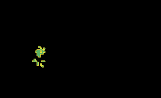

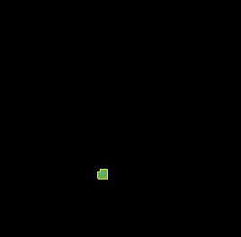

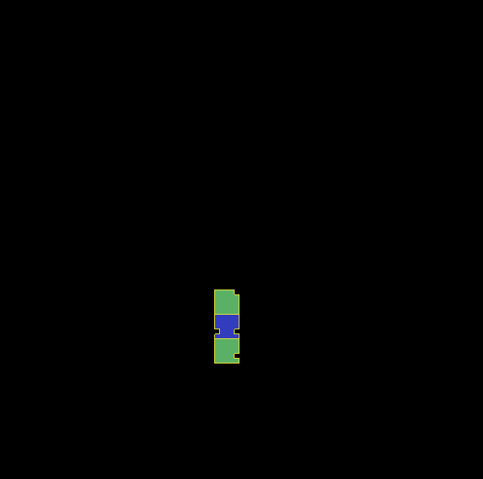

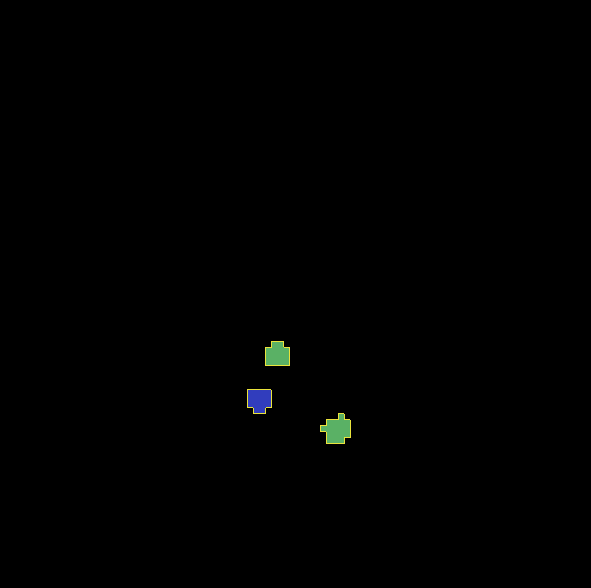

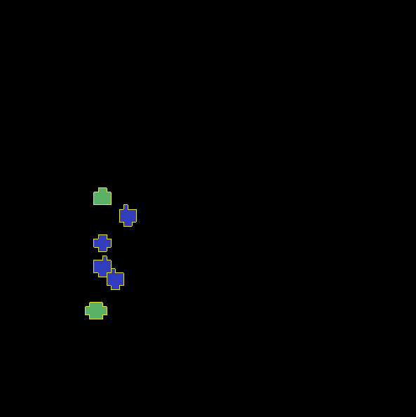

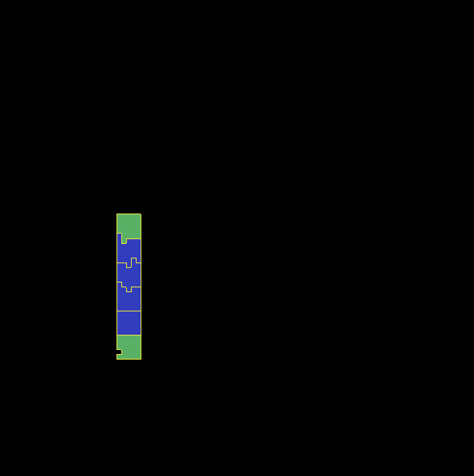

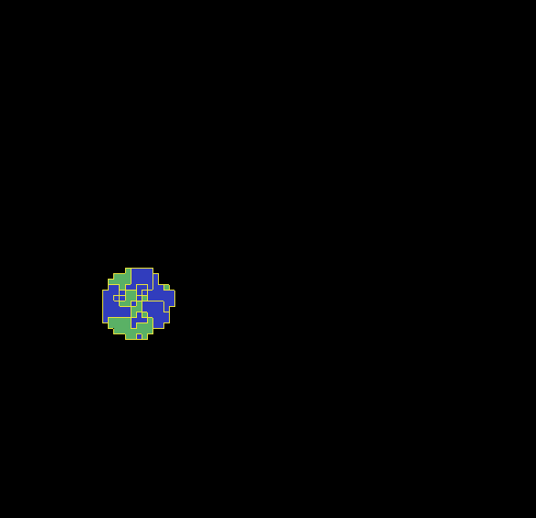

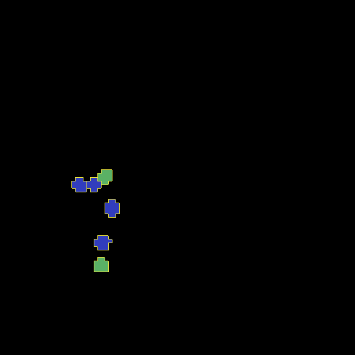

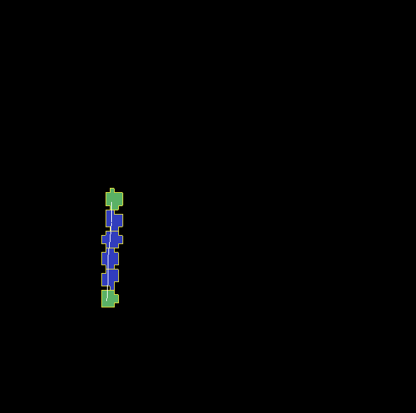

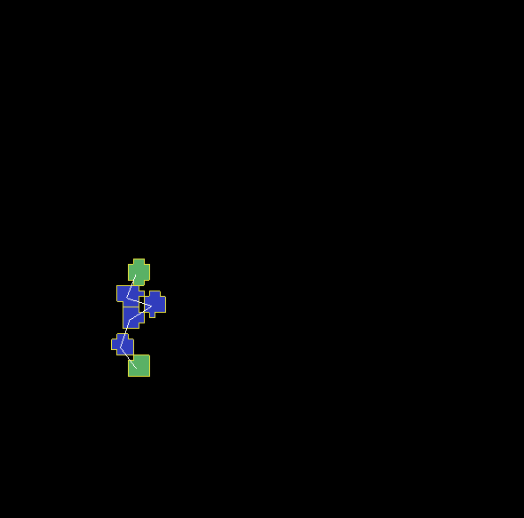

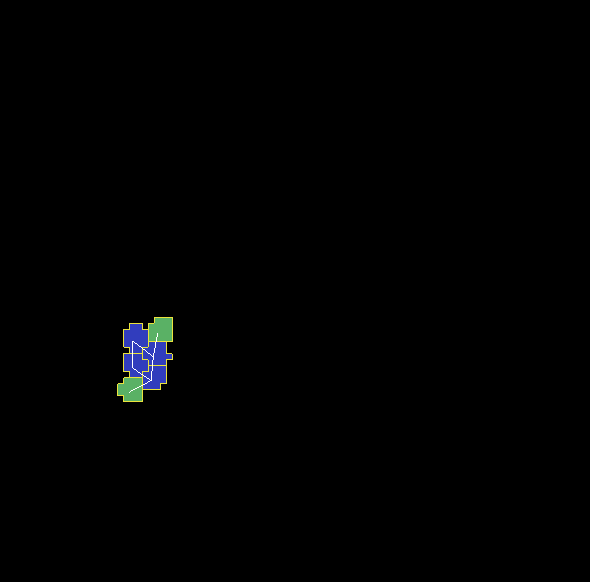

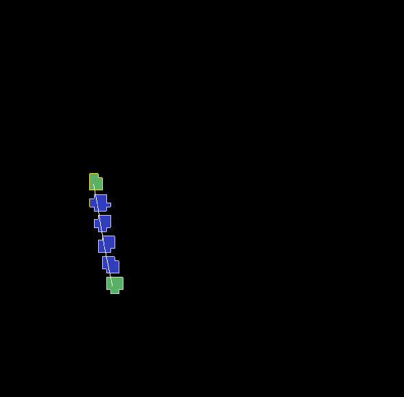

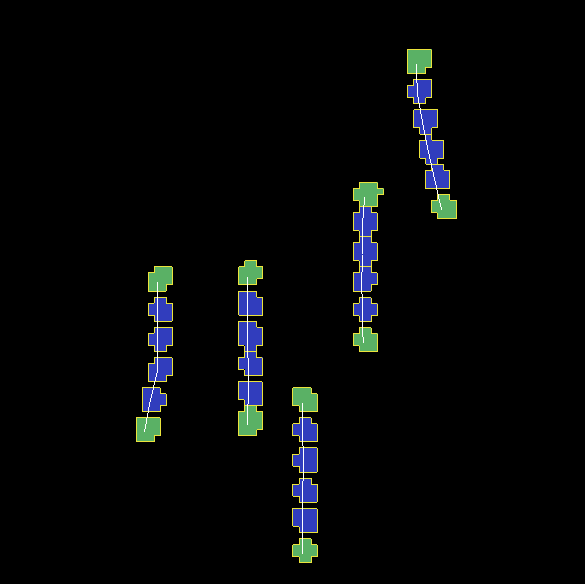

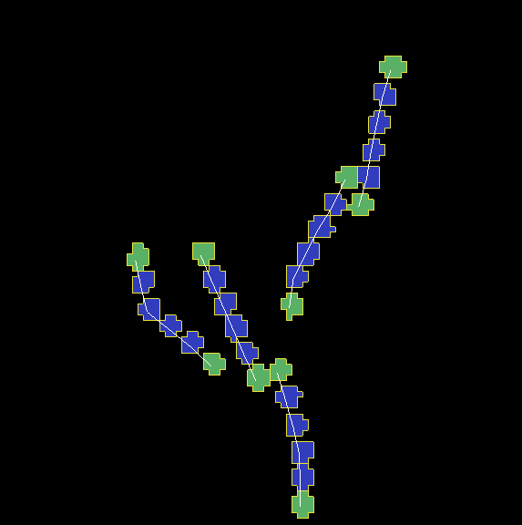

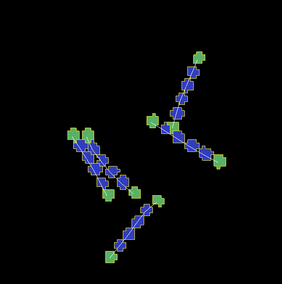

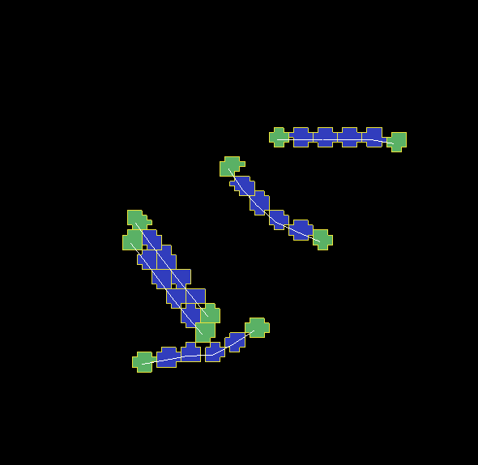