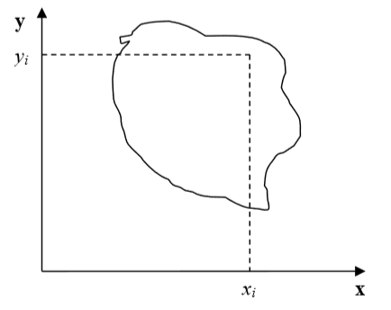
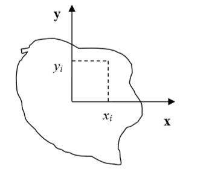
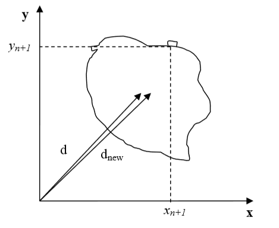

Calculating Inertia tensor In CC3D
-------------------------------------

For each cell the inertia tensor is defined as follows:

.. math::
   :nowrap:

   \begin{eqnarray}

    I = \begin{bmatrix}
    \sum_i y_i^2+z_i^2 & -\sum_i x_i y_i & -\sum_i x_i z_i \\
    -\sum_i x_i y_i & \sum_i x_i^2+z_i^2 & -\sum_i y_i z_i \\
    -\sum_i x_i z_i & -\sum_i  y_i z_i & \sum_i x_i^2+y_i^2 \\
    \end{bmatrix}
   \end{eqnarray}

where index :math:`i` denotes ``i-th`` pixel of a given cell and :math:`x_i`,
:math:`y_i` and :math:`z_i` are coordinates of that pixel in a given
coordinate frame.

|inertia_tensor_fig3|

**Figure 3:** Cell and coordinate system passing through center of mass of a cell.
Notice that as cell changes shape the position of center of mass moves.

|inertia_tensor_fig4|

**Figure 4:** Cell and its coordinate frame in which we calculate inertia tensor

In Figure 4 we show one possible coordinate frame in which one can
calculate inertia tensor. If the coordinate frame is fixed calculating
components of inertia tensor for cell gaining or losing one pixel is
quite easy. We will be adding and subtracting terms like or .

However, in CompuCell3D we are mostly interested in knowing tensor of
inertia of a cell with respect to *xyz* coordinate frame with origin at
the center of mass (*COM*) of a given cell as shown in Figure 3 Now, to
calculate such tensor we cannot simply add or subtract terms like or to
account for lost or gained pixel. If a cell gains or loses a pixel its
COM coordinates change. If so then all the *x\ :sub:`i`,
y\ :sub:`i`,z\ :sub:`i`* coordinates that appear in the inertia tensor
expression will have different value. Thus for each change in cell shape
(gain or loss of pixel) we would have to recalculate inertia tensor from
scratch. This would be quite time consuming and would require us to keep
track of all the pixels belonging to a given cell. It turns out however
that there is a better way of keeping track of inertia tensor for cells.
We will be using parallel axis theorem to do the calculations. Paralel
axis theorem states that if I\ :sub:`COM` is a moment of inertia with
respect to axis passing through center of mass then we can calculate
moment of inertia with respect to any parallel axis to the one passin
through the COM by using the following formula:

where denotes moment of inertia with respect to *x* axis passing through
center of mass, is a moment of inertia with respect to axis parallel to
the *x* axis passing through center of mass, *d* is the distance between
the axes and *M* is mass of the cell.

Let us now draw a picture of a cell gaining one pixel:

Now using parallel axis theorem we can write expression for the moment
of inertia after cell gains one pixel the following that:

where as before denotes moment of inertia of a cell with new pixel with
respect to *x* axis passing through center of mass, is a moment of
inertia with respect to axis parallel to the *x* axis passing through
center of mass, *d\ :sub:`new`* is the distance between the axes and
*V+1* is volume of the cell after it gained one pixel. Now let us
rewrite above equation by adding ad subtracting *Vd\ :sup:`2`* term:

Therefore we have found an expression for moment of inertia passing
through the center of mass of the cell with additional pixel. Note that
this expression involves moment of inertia but for the old cell (*i.e*.
the original cell, not the one with extra pixel). When we add new pixel
we know its coordinates and we can also easily calculate *d\ :sub:`new`*
.Thus when we need to calculate the moment of intertia for new cell
instead of performing summation as given in the definition of the
inertia tensor we can use much simpler expression.

This was diagonal term of the inertia tensor. What about off-diagonal
terms? Let us write explicitely expression for *I­\ :sub:`xy`* :

where denotes *x* COM position of the cell, similarly denotes *y* COM
position of cell and *V* denotes cell volume. In the above formula we
have used the fact that

and similarly for the *y* coordinate.

Now, for the new cell with additional pixel we have the following
relation:

where we have added and subtracted to be able to form on the right hand
side of the expression for . As it was the case for diagonal element,
calculating off-diagonal of the inertia tensor involves and positions of
center of mass of the cell before and after gaining new pixel. All those
quantities are either known a priori () or can be easily calculated
(center of mass position after gaining one pixel).

Therefore we have shown how we can calculate tensor of inertia for a
given cell with respect to a coordinate frame with origin at cell's
center of mass, without evaluating full sums. Such "local" calculations
greatly speed up simulations

