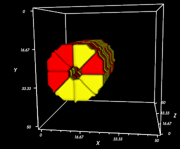
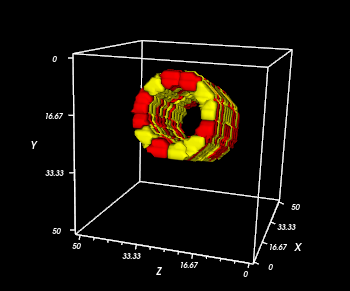
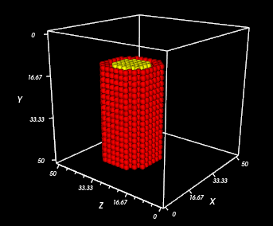
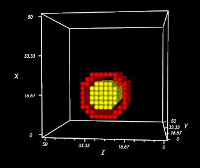

TubeInitializer Steppable
------------------------------

.. _blob_initializer: blob_initializer

``TubeInitializer`` arranges cells in a cylinder shape. 
It is intended for **3D simulations**. See **Blob Initializer** for 2D circles.

Properties
===================

**InnerRadius**: Determines how hollow to make the tube. Set to 0 to fill the tube completely with cells.

**OuterRadius**: Determines the size of the tube. It must be greater than InnerRadius. 

**Extrude**: Controls the length of the tube. The rings of the tube are placed around the imaginary axis created between the **From** and **To** points. 
 * **From** and **To**: Specify the top and bottom of the tube in positive integer 3D coordinates. 

**Width**: Controls the thickness of each ring of cells in the tube.

**NumSlices**: Controls how many cells should be placed on each ring.
 * Default: 8

**CellShape**: Must be either ``Cube`` or ``Wedge``.
 * Default: Wedge

**Gap**: Places the rings farther apart, and makes the slices "exploded" from one another (i.e. spaced out). 
 * Default: 0

===================

**Example Syntax:** Basic 3D Tube, Wedge-Shaped Cells
******************************************************************

Add the below Steppable to your XML file. This example is on a 50x50x50 lattice and uses all the default properties.

.. code-block:: xml

   <Steppable Type="TubeInitializer">
      <Region>
         <InnerRadius>3</InnerRadius>
         <OuterRadius>12</OuterRadius>
         <Gap>0</Gap>
         <Width>5</Width>
         <NumSlices>8</NumSlices>
         <Types>Condensing,NonCondensing</Types>
         <Extrude>
           <From x="15" y="25" z="0" />
           <To x="15" y="25" z="50" />
         </Extrude>
         <CellShape>Wedge</CellShape>
      </Region>
   </Steppable>

**Result**

Notice that one end of the tube is at (15, 25, 0) and the other end is at (15, 25, 0), so the tube is extruded along the z-axis. 
Since there are two cell types, the cells are randomly chosen to be red or yellow. 

===================

**Example Syntax:** Diagonal 3D Tube, Wedge-Shaped Cells
******************************************************************

Now, **NumSlices** is 12,the **InnerRadius** is larger, 
and the **From** and **To** points have been changed to place the tube at an angle.

.. code-block:: xml

   <Steppable Type="TubeInitializer">
      <Region>
         <InnerRadius>8</InnerRadius>
         <OuterRadius>12</OuterRadius>
         <Gap>0</Gap>
         <Width>3</Width>
         <NumSlices>12</NumSlices>
         <Types>Condensing,NonCondensing</Types>
         <Extrude>
           <From x="10" y="15" z="25" />
           <To x="45" y="25" z="25" />
         </Extrude>
      </Region>
   </Steppable>

**Result**

===================

**Example Syntax:** Two-layer 3D Tube, Cube-Shaped Cells
******************************************************************

Tubes can be nested within one another by specifying multiple ``Region`` tags
and by making the ``InnerRadius``/``OuterRadius`` smaller for one.
The cells have been made square-shaped by writing ``<CellShape>Cube</CellShape>``.

.. code-block:: xml

   <Steppable Type="TubeInitializer">
      <Region>
          <InnerRadius>8</InnerRadius>
          <OuterRadius>11</OuterRadius>
         <Gap>0</Gap>
         <Width>2</Width>
         <Types>Condensing</Types>
         <Extrude>
           <From x="15" y="45" z="25" />
           <To x="15" y="10" z="25" />
         </Extrude>
         <CellShape>Cube</CellShape>
      </Region>
      <Region>
          <InnerRadius>0</InnerRadius>
          <OuterRadius>7</OuterRadius>
         <Gap>0</Gap>
         <Width>2</Width>
         <Types>NonCondensing</Types>
         <Extrude>
           <From x="15" y="45" z="25" />
           <To x="15" y="10" z="25" />
         </Extrude>
         <CellShape>Cube</CellShape>
      </Region>
   </Steppable>

**Result**

